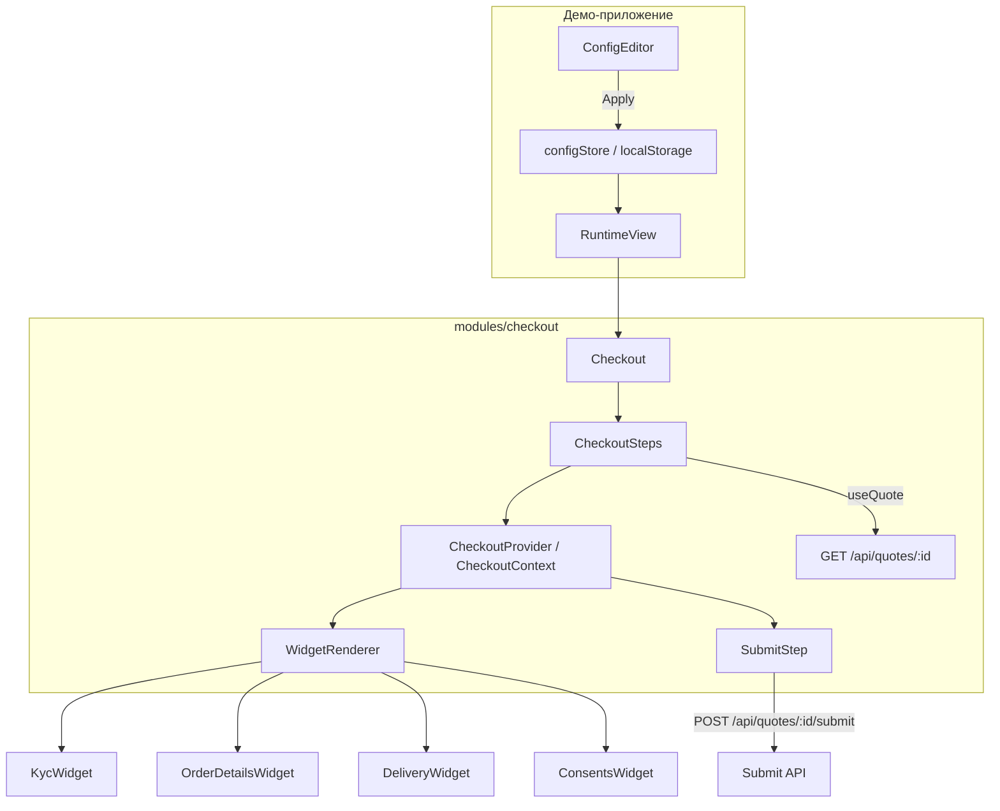

# Configurable Checkout: checkout-форма, которую собирают из JSON, а не из релиза

> Черновик статьи для [Habr](https://habr.com). Репозиторий: [configurable-checkout](https://github.com/stswoon/configurable-checkout).  
> Живая демо-архитектура описана также в [блоге автора](https://blog.stswoon.ru/pages/2026/ConfigurableCheckout/index.html).

---

## TL;DR

**Configurable Checkout** — учебный, но осмысленный прототип checkout-потока для телекома и e-commerce, где порядок шагов, набор виджетов и их параметры задаются **JSON-конфигурацией**, а не жёстко зашиты в React-компоненты. Слева — редактор конфига, справа — живой runtime. Бэкенд — Express с файловым хранилищем JSON, фронт — React 19 + Rspack + shadcn/ui.

Идея простая: один раз написать набор **шагов-виджетов** (`KycWidget`, `OrderDetailsWidget`, …), зарегистрировать их в реестре, а продуктовая команда или интегратор собирает checkout как конструктор — меняет порядок, включает/выключает шаги, настраивает параметры (`identificationType: "phone"`, список согласий и т.д.) без деплоя фронтенда.

---

## Зачем это нужно

В реальных продуктах checkout редко бывает «один на всех»:

- в одном канале нужна идентификация по телефону, в другом — по email;
- для B2B пропускают маркетинговые согласия, для B2C — нет;
- A/B-тест: landing со всеми блоками сразу vs классический stepper;
- white-label: партнёрам нужен другой порядок шагов при том же бэкенде.

Классический путь — ветки в коде, feature flags, копипаста экранов. Альтернатива — **config-driven UI**: конфиг описывает *что* показать, React знает *как* это отрисовать.

Этот репозиторий — минимальный, но цельный пример такого подхода: не CMS-монстр и не low-code платформа, а **чёткий контракт** между конфигом, виджетом и доменной сущностью `Quote`.

---

## Что внутри репозитория

Monorepo из трёх частей:

| Часть | Стек | Роль |
|-------|------|------|
| `frontend/` | React 19, Rspack, Tailwind 4, shadcn/ui, SWR, Zustand, react-hook-form | UI checkout, редактор конфига, runtime preview |
| `backend/` | Express, TypeScript | REST API, JSON-файлы на диске |
| `shared/` | TypeScript | Общие типы (`QuoteType`) для FE и BE |

Запуск:

```bash
npm install
npm run dev          # backend :3100 + frontend :3000
npm run dev:backend  # только API
npm run dev:frontend # только UI, /api/* проксируется на backend
```

Health check: `GET http://localhost:3100/health`.

---

## Демо-приложение: редактор + runtime

Экран разделён пополам (`App.tsx`):

```
┌─────────────────────────┬──────────────────────────────────┐
│  ConfigEditor (40%)     │  RuntimeView (60%)               │
│  ─────────────────────  │  ──────────────────────────────  │
│  Quote ID (select)      │  Live preview checkout           │
│  JSON5 textarea         │  по выбранному конфигу и quote  │
│  [Apply] [Example]      │                                  │
└─────────────────────────┴──────────────────────────────────┘
```

**ConfigEditor** (`frontend/src/components/ConfigEditor.tsx`):

- загружает список quote ID с бэкенда;
- принимает конфиг в формате **JSON5** (комментарии, одинарные кавычки — удобно для ручного редактирования);
- парсит через `parseCheckoutConfig`, сохраняет в Zustand + `localStorage`;
- кнопка **Example** подтягивает `backend/data/config/default.json5`.

**RuntimeView** читает конфиг и `quoteId` из store и рендерит `<Checkout />`.

Важно: в демо **Apply не пишет конфиг на сервер** — только localStorage. API конфигов есть (`/api/config`), но редактор сознательно local-first, чтобы мгновенно экспериментировать.

---

## Доменная модель: Quote

Каноническая сущность — `Quote` (`shared/QuoteType.ts`):

```typescript
export interface QuoteType {
    id: string;
    status: "OPEN" | "IN_PROGRESS" | "SUBMITTED" | "CANCELLED";
    order: Product[];
    userInfo: { documentType: string; documentId: string };
    delivery: Delivery;
}
```

Checkout не «создаёт заказ с нуля» — он **дозаполняет и отправляет** уже существующий quote. Статус меняется только при submit (`OPEN` → `IN_PROGRESS`).

Пример данных (`backend/data/quotes/quote-001.json`): тарифный план, SIM-карты, телефон пользователя, адрес доставки.

---

## Схема конфигурации

Конфиг checkout — объект с массивом виджетов:

```json5
{
  stepperView: "landing",  // "landing" | "stepper"
  widgets: [
    {
      stepId: "userInfo",
      stepTitle: "Know Your Customer",
      widgetType: "KycWidget",
      widgetParams: {
        identificationType: "phone"  // "phone" | "email"
      }
    },
    {
      stepId: "order",
      stepTitle: "Order Details",
      widgetType: "OrderDetailsWidget"
    },
    {
      stepId: "delivery",
      stepTitle: "Delivery",
      widgetType: "DeliveryWidget"
    },
    {
      stepId: "n4",
      stepTitle: "Consents",
      widgetType: "ConsentsWidget"
    }
  ]
}
```

| Поле | Назначение |
|------|------------|
| `stepperView` | Режим отображения: все шаги на одной странице (`landing`) или пошаговый wizard (`stepper`) |
| `stepId` | Уникальный ключ шага в контексте checkout; по нему хранятся значения формы |
| `stepTitle` | Заголовок для stepper UI |
| `widgetType` | Строка → компонент из `WIDGET_REGISTRY` |
| `widgetParams` | Параметры, специфичные для типа виджета (не попадают в quote напрямую) |

`stepId` и `widgetType` разделены намеренно: один тип виджета может встретиться дважды с разными `stepId` (например, два блока согласий с разными `widgetParams.consents`).

---

## Архитектура runtime



### Точка входа: `Checkout` → `CheckoutSteps`

1. `CheckoutSteps` загружает quote по `quoteId` (SWR).
2. Строит начальные `stepParams` из quote через `STEP_PARAM_HANDLERS`.
3. Оборачивает UI в `CheckoutProvider`.
4. В зависимости от `stepperView`:
   - **landing** — все виджеты + `SubmitStep` на одной странице;
   - **stepper** — `CheckoutStepper` показывает один активный шаг + навигация Back/Next, финальный шаг — submit.

### CheckoutContext — общее состояние wizard

`CheckoutContext` (`CheckoutContext.tsx`) — центральный контракт:

- **`stepParams`** — `Record<stepId, unknown>`: накопленные ответы всех шагов;
- **`setStepParam(stepId, value)`** — виджет пишет сюда через `onSubmit`;
- **навигация** — `nextStep`, `prevStep`, `currentStepIndex` (только в режиме stepper);
- **валидация** — виджеты регистрируют `StepValidator`; перед Next/Submit контекст вызывает их.

Виджеты **не** хранят глобальный step index и **не** рисуют свои кнопки «Далее» — это ответственность stepper/shell.

### WidgetRenderer — мост конфиг → React

```typescript
const Component = WIDGET_REGISTRY[widgetType];
return (
    <Component
        stepId={stepId}
        value={value}           // из stepParams[stepId]
        onSubmit={setValue}       // пишет в контекст
        params={widgetParams}
        quoteId={quoteId}
    />
);
```

Неизвестный `widgetType` → `UnknownWidget` (fallback без падения всего checkout).

### Контракт виджета

Каждый шаг реализует `CheckoutWidgetProps<T, P>`:

```typescript
interface CheckoutWidgetProps<T, P> {
    stepId: string;
    value: T;
    onSubmit: (value: T) => void;
    params?: P;
    quoteId: string;
}
```

- **`value` / `onSubmit`** — связь с контекстом;
- **`params`** — конфиг из JSON (`widgetParams`);
- **`quoteId`** — для шагов с немедленной персистенцией на бэкенд.

---

## Реестр виджетов

`frontend/src/modules/checkout/registry.ts`:

| widgetType | Что делает | widgetParams |
|------------|------------|--------------|
| `KycWidget` | KYC: телефон или email, lookup в mock IDP | `identificationType?: "phone" \| "email"` |
| `OrderDetailsWidget` | Список позиций, +/- количество, пересчёт цены | — |
| `DeliveryWidget` | Адрес и дата доставки (dd.mm.yyyy) | — |
| `ConsentsWidget` | Чекбоксы согласий | `consents?: { id, label, required? }[]` |

Добавление нового типа — три шага:

1. `widgets/MyWidget.tsx` + регистрация в `WIDGET_REGISTRY`;
2. при необходимости — handler в `stepParamHandlers.ts` (`fromQuote` / `toPatch`);
3. запись в example-конфиг.

---

## От stepParams к Quote: STEP_PARAM_HANDLERS

Checkout хранит ответы шагов в **своей** форме (`stepParams`), а quote на бэкенде — в **доменной**. Маппинг инкапсулирован в `STEP_PARAM_HANDLERS`:

```typescript
interface StepParamHandler {
    fromQuote: (quote: QuoteType) => unknown;  // инициализация формы
    toPatch: (value: unknown) => Partial<QuoteType>;  // патч при submit
}
```

Пример для KYC:

- **fromQuote** — `{ identification: quote.userInfo.documentId }`;
- **toPatch** — `{ userInfo: { documentType, documentId } }` (email определяется по `@`).

`ConsentsWidget` не пишет в quote (`toPatch: () => ({})`) — согласия живут только в checkout state до submit (в production их можно добавить в quote или отдельный audit log).

При submit `SubmitStep` собирает патч:

```typescript
const patch = buildQuotePatchFromStepParams(stepParams, widgets);
await submitQuote(quoteId, patch);
```

---

## Валидация и формы

Виджеты используют **react-hook-form**. Хук `useCheckoutWidgetForm`:

1. регистрирует validator шага в контексте;
2. при успешной валидации вызывает `onSubmit` (синхронизирует `stepParams`);
3. помечает карточку классом `checkout-widget-error` для scroll-to-error.

В stepper-режиме **Next** не переключит шаг, пока текущий validator не вернёт `true`. На landing все validators вызываются разом при **Submit**.

`KycWidget` — отдельный сценарий: поле valid только после успешного `POST /api/idp/lookup` (mock пользователей в `backend/data/idp/users.json`).

---

## OrderDetailsWidget: debounced save

Изменение количества товаров — не только локальный state. `useDebouncedOrderSave`:

- оптимистично обновляет UI;
- через 400 ms шлёт `PUT /api/quotes/:id` с пересчитанным `order`;
- бэкенд пересчитывает `totalPrice` (`quotePricing.ts`);
- после успеха синхronизирует `stepParams`.

Так моделируется типичный паттерн: **часть данных персистится сразу**, часть — только на финальном submit.

---

## SubmitStep

Фиксированный финальный блок (не из JSON-конфига):

- чекбокс «готов отправить»;
- валидация всех шагов;
- сбор патча + `POST /api/quotes/:id/submit`;
- статус quote → `IN_PROGRESS`;
- debug-диалог с дампом `stepParams` (удобно при разработке конфигов).

В stepper-режиме submit — отдельный виртуальный шаг `__submit__` после всех виджетов.

---

## Backend API

| Method | Path | Описание |
|--------|------|----------|
| GET | `/api/config` | Список id конфигов |
| GET | `/api/config/example` | Example JSON5 |
| GET/PUT | `/api/config/:id` | CRUD конфига (legacy schema на BE) |
| GET | `/api/quotes` | Список quote id |
| GET/PUT | `/api/quotes/:id` | Чтение/обновление quote |
| POST | `/api/quotes/:id/submit` | Submit + смена статуса |
| POST | `/api/idp/lookup` | KYC lookup по email/phone |
| GET | `/api/idp/users/:id` | Mock пользователь |

Persistence — **JSON-файлы** (`backend/src/lib/jsonStore.ts`): без БД, идеально для прототипа и CI.

`PUT /quotes/:id` **не** меняет status — только submit. Это явное разделение «редактируем корзину» vs «отправили заявку».

---

## Два режима UI: landing vs stepper

| | `landing` | `stepper` |
|---|-----------|-----------|
| Layout | Все виджеты вертикально | Один шаг + Back/Next |
| Submit | Внизу страницы | Отдельный финальный шаг |
| Валидация Next | — | По текущему шагу |
| Use case | Быстрый обзор, мобильные «длинные» формы | Классический wizard, снижение cognitive load |

Переключение — одна строка в JSON. Один и тот же набор виджетов, два UX без дублирования кода.

---

## Технологические решения

**React 19 + Rspack** — быстрая сборка, workspaces monorepo.

**shadcn/ui** (`@/ui/*`) — примитивы без vendor lock-in; обёртки с async/loading — в `@/ui-extra/*` (например, `AsyncSelect` в редакторе quote).

**SWR** — кеш quote, мутация после submit.

**Zustand** — минимальный store для demo-редактора.

**JSON5** — человекочитаемый конфиг с комментариями (важно для Habr-аудитории: конфиг правят не только разработчики).

**Shared types** — `QuoteType` импортируется и на FE (`@shared/QuoteType`), и на BE; расхождение схем ловится TypeScript.

---

## Ограничения прототипа (честно)

Это **демо**, не production checkout:

- нет auth-сессии в UI (IDP mock);
- конфиг редактора не синхронизируется с `/api/config` по Apply;
- нет версионирования конфигов, A/B на сервере, i18n;
- `ConsentsWidget` не сохраняется в quote;
- нет e2e-тестов (проверка вручную через dev UI);
- legacy schema на бэкенде (`id`/`type`/`props`) сосуществует с новой (`stepId`/`widgetType`/`widgetParams`) — миграция не завершена.

Зато архитектура **расширяема** в правильном направлении: context, registry, handlers — не «God component» на 2000 строк.

---

## Как это перенести в production

1. **Конфиг с сервера** — `GET /checkout-config?product=…&channel=…` вместо localStorage; версия конфига в quote metadata.
2. **Route entry** — `/?quoteId=…` + `CheckoutProvider` на уровне страницы, без split-pane редактора.
3. **Feature flags** — `widgetParams` или условные виджеты в конфиге (при необходимости — mini-DSL).
4. **Observability** — события по `stepId` (view, validate error, submit).
5. **Новые виджеты** — только registry + handler; CI проверяет, что все `widgetType` из конфигов зарегистрированы.

Паттерн близок к **micro-frontends без iframe**: общий shell (context + stepper), плагины-виджеты с единым контрактом.

---

## Пример сценария end-to-end

1. Запустить `npm run dev`, открыть `http://localhost:3000`.
2. Выбрать `quote-001`, нажать **Example**, **Apply**.
3. Справа: KYC (phone), заказ с двумя позициями, дelivery, consents.
4. В KYC ввести `+7 123 456 78 90` → **Validate** → «Verified».
5. Увеличить количество SIM — через паузу увидеть «Updating quote…».
6. Заполнить delivery, отметить обязательные consents.
7. **Submit** → quote на диске получит `status: "IN_PROGRESS"` и обновлённые поля.

Поменять `stepperView` на `"stepper"` — тот же flow, но по шагам с Back/Next.

---

## Выводы

Configurable Checkout показывает, как **отделить композицию checkout от реализации шагов**:

- JSON описывает *сценарий*;
- виджеты — *переиспользуемые блоки* с typed params;
- `CheckoutContext` — *единый state machine* навигации и данных;
- `STEP_PARAM_HANDLERS` — *anti-corruption layer* между UI-state и доменом `Quote`.

Для Habr-читателя главный takeaway: не обязательно покупать тяжёлую low-code платформу, чтобы получить гибкий checkout. Достаточно дисциплины в контрактах (registry, context, handlers) и конфига, который могут править те, кто знает продукт — а не только те, кто знает JSX.

---

## Полезные ссылки

- Репозиторий: https://github.com/stswoon/configurable-checkout
- Блог с диаграммой: https://blog.stswoon.ru/pages/2026/ConfigurableCheckout/index.html
- Диаграмма в репо: `docs/img.png`
- Инструкции для агентов/контributors: `AGENTS.md`

---

*Автор прототипа: [stswoon](https://blog.stswoon.ru). Статья подготовлена по состоянию кодовой базы август 2026.*
